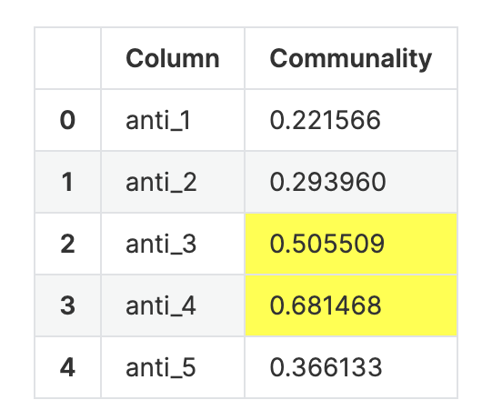
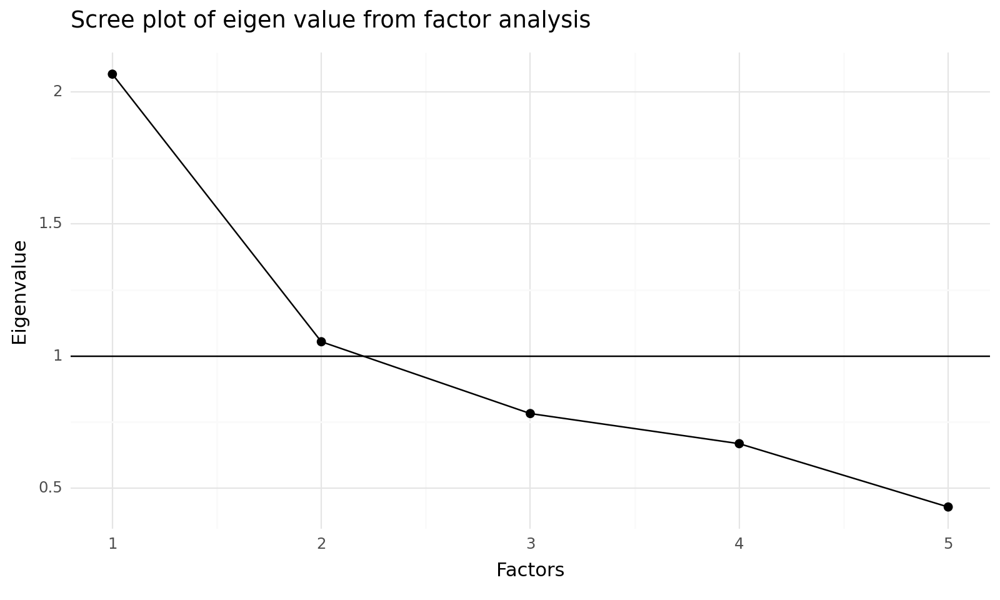
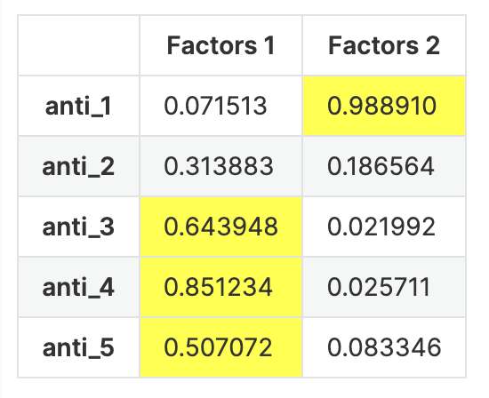
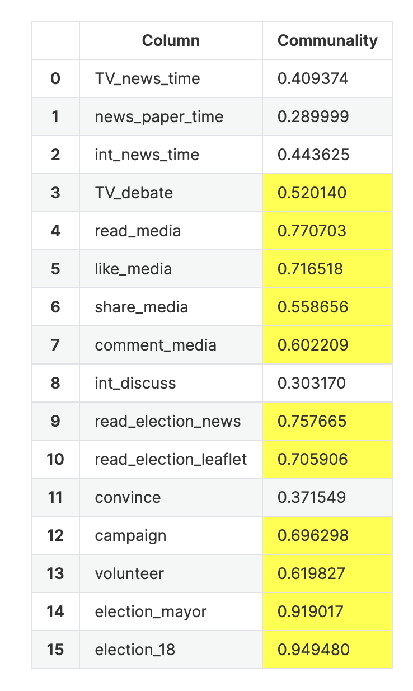
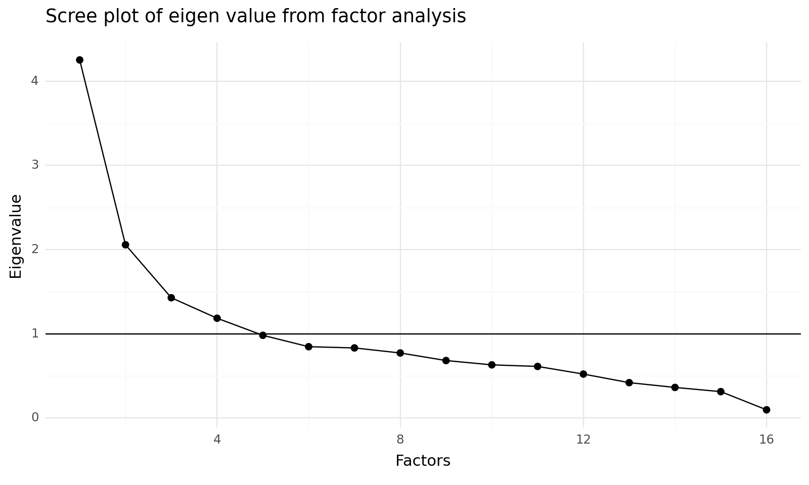
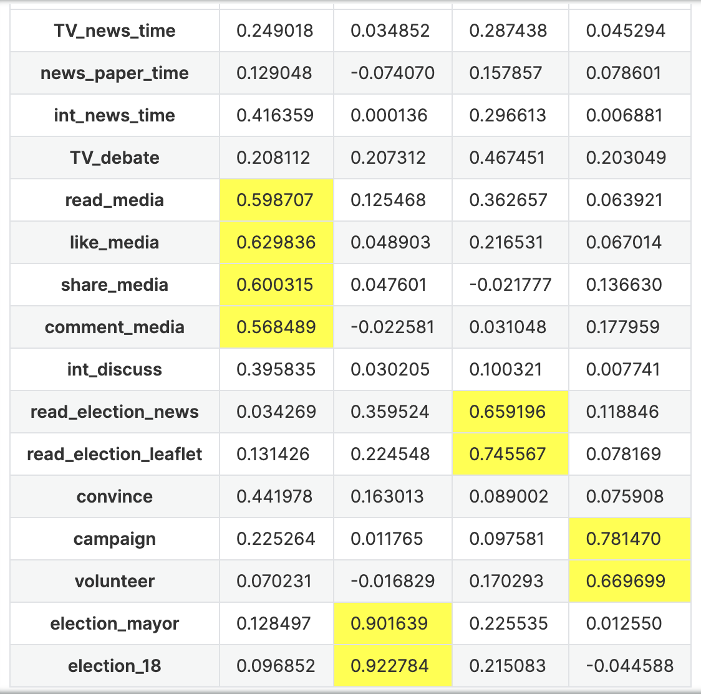

Badge [source](https://shields.io/)

# media_political

## Authors
- [@IsaacLee0904](https://github.com/IsaacLee0904)

## Table of Contents
  - [Data Source](#data-source)
  - [Repository structure](#repository-structure)
  - [Workflow](#workflow)


## Data Source
  - Survey data

## Repository structure
```
├── ETL.py                            <- Python code for data ETL.
├── ETL_function.py                   <- Python code with all function for ETL.
├── Factor_Analysis.py                <- Python code with all function for factor analysis.
├── DV_FAC.ipynb                      <- notebook with dependent variable factor analysis.
├── anti_party_FAC.ipynb              <- notebook with independent variable factor analysis.
├── Reliability_testing.ipynb         <- notebook with reliability testing for all index.
├── media_political_analysis.ipynb    <- modeling.
└── raw_data.csv
```

## Workflow 
### Step1. Cleaning Data
* Reshape raw data as a dataframe named ml_df 
* Filter out dependent variable as a dataframe named IV_df
* Filter out independent variable as a dataframe named IV_df
### Step2. Factor analysis
  #### Independent Variable
  * Result of Bartlett’s test 
    * Chi-square value : 358.638 
    * p-value          : 0.0
      * The Bartlett test produces a p-value that is less than 0.05. It means, we reject the null hypothesis or in this case, at least two     population variances are different.
  * Result of Kaiser-Meyer-Olkin(KMO)
    * KMO value : 0.675
      *  The KMO test produces a KMO value 0.675 which is great than the standard 0.5
  * Communality testing
    
    
    * Result 
      * The yellow color indicates that the communality values meet the criteria — greater than 0.5. Eliminated Variable below 0.5 .
      * Also according to the Kaiser criteria, the number of factors generated is 2. It means that the 5 columns or well-known variables will be grouped and interpreted into 2 indicators.
        
    
    * Result 
      * According to the scree plot we will get the elbow at 2 groups .
     
    
    * Result
      * According to the result above and reference can extract 2 indicators from 6 varaibles
        1. 極化現象(political_polarization) : anti_1
        2. 政黨形象(party_image) : anti_3 / anti_4 / anti_5

  #### Dependent Variable
  * Result of Bartlett’s test 
    * Chi-square value : 2616.18
    * p-value          : 0.0
      * The Bartlett test produces a p-value that is less than 0.05. It means, we reject the null hypothesis or in this case, at least two     population variances are different.
  * Result of Kaiser-Meyer-Olkin(KMO)
    * KMO value : 0.771
      *  The KMO test produces a KMO value 0.675 which is great than the standard 0.5
  * Communality testing
    
    
    * Result 
      * The yellow color indicates that the communality values meet the criteria — greater than 0.5. Eliminated Variable below 0.5 .
      * Also according to the Kaiser criteria, the number of factors generated is 4. It means that the 5 columns or well-known variables will be grouped and interpreted into 4 indicators.
        
    
    * Result 
      * According to the scree plot we will get the elbow at 4 groups .
     
    
    * Result
      * According to the result above and reference can extract 4 indicators from 16 varaibles
        1. 線上媒體政治參與(online_media_pp) : read_media / like_media / share_media / comment_media
            -> reference : 劉嘉薇，2019
        2. 投票參與(voting) : election_mayor / election_18
            -> reference : Barnes and Kaase (1979)
        3. 線下媒體政治參與(offline_media_pp) : read_election_news / read_election_leaflet
            -> reference : 徐火炎，2001
        4. 競選工作式政治參與(campaign_worker_pp) : campaign / volunteer
            -> reference : Mibrath and Goel，1977
    
### Step3. Establish Index with result of factor analysis and reliability testing 
1. Method1 : Grouping without FAC but with reference or domain knowledge
  #### Independent Variable
```python
anti_party_vars = ['anti_1', 'anti_2', 'anti_3', 'anti_4', 'anti_5']
ml_df['anti_party'] = ml_df[anti_party_vars].mean(axis=1)
```
* Reliability Testing Result :
  * anti_party Cronbach's alpha:  0.7564819668378749
#### Dependent Variable
```python
online_pp_vars = ['TV_news_time', 'news_paper_time', 'int_news_time', 'TV_debate',     'read_media', 'like_media', 'share_media', 'comment_media', 'int_discuss']
offline_pp_vars = ['read_election_news', 'read_election_leaflet', 'convince', 'campaign', 'volunteer', 'election_mayor', 'election_18']
ml_df['online_pp'] = ml_df[online_pp_vars].mean(axis=1)
ml_df['offline_pp'] = ml_df[offline_pp_vars].mean(axis=1)
```
* Reliability Testing Result :
  * online_pp Cronbach's alpha:  0.7717699094188335
  * offline_pp Cronbach's alpha:  0.809844435651358
  * Total Cronbanc's alpha: 0.7908071725350958
    
2. Method2 : Get factors's mean after FAC(因素分析 -> 根據構面取平均)
  #### Independent Variable
```python
political_polarization_vars = ['anti_1']
party_image_vars = ['anti_3', 'anti_4', 'anti_5']
ml_df['political_polarization_mean'] = ml_df[political_polarization_vars].mean(axis=1)
ml_df['party_image_mean'] = ml_df[party_image_vars].mean(axis=1)
```
* Reliability Testing Result :
  * political_polarization_mean Cronbach's alpha:  1.0
  * party_image_mean Cronbach's alpha:  0.8485172366992396
  * Total Cronbanc's alpha: 0.9242586183496198
#### Dependent Variable
```python
ml_df['online_media_pp_mean'] = ml_df[online_media_pp_vars].mean(axis=1)
ml_df['voting_mean'] = ml_df[voting_vars].mean(axis=1)
ml_df['offline_media_pp_mean'] = ml_df[offline_media_pp_vars].mean(axis=1)
ml_df['campaign_worker_pp_mean'] = ml_df[campaign_worker_pp_vars].mean(axis=1)
```
* Reliability Testing Result : 
  * online_media_pp_mean Cronbach's alpha:  0.8150949007062644
  * voting_mean Cronbach's alpha:  0.9821418184416829
  * offline_media_pp_mean Cronbach's alpha:  0.9267895495036798
  * campaign_worker_pp_mean Cronbach's alpha:  0.9058515655096367
  * Total Cronbanc's alpha: 0.9074694585403159
    
3. Method3 : Total score after FAC(因素分析 -> 根據構面取綜合得分)
  #### Independent Variable
```python
# Factor analysis with rotation
fa = FactorAnalyzer(n_factors = 2, rotation = 'varimax')
fa.fit(IV_df)
# Create a factor's names
facs = ['Factors' + ' ' + str(i + 1) for i in range(2)]
df_factors = pd.DataFrame(data = fa.fit_transform(IV_df),columns = facs)
df_factors.rename(columns = {'Factors 1': 'political_polarization_score', 
                           'Factors 2': 'party_image_score'}, inplace = True)  
ml_df = ml_df.join(df_factors)  
```
* Reliability Testing Result :
  * political_polarization_mean Cronbach's alpha:  1.0
  * party_image_mean Cronbach's alpha:  0.8485172366992396
  * Total Cronbanc's alpha: 0.9242586183496198  
#### Dependent Variable
```python
# Factor analysis with rotation
fa = FactorAnalyzer(n_factors = 4, rotation = 'varimax')
fa.fit(DV_df)
# Create a factor's names
facs = ['Factors' + ' ' + str(i + 1) for i in range(4)]
df_factors = pd.DataFrame(data = fa.fit_transform(DV_df),columns = facs)                   
df_factors.rename(columns = {'Factors 1': 'online_media_pp_score', 
                           'Factors 2': 'voting_score',
                           'Factors 3': 'offline_media_pp_score',
                           'Factors 4': 'campaign_worker_pp_score'}, inplace = True)
ml_df = ml_df.join(df_factors)   
```
* Reliability Testing Result : 
  * online_media_pp_score Cronbach's alpha:  0.8311674955098114
  * voting_score Cronbach's alpha:  0.9666132108881862
  * offline_media_pp_score Cronbach's alpha:  0.8956567852883418
  * campaign_worker_pp_score Cronbach's alpha:  0.9058515655096367
  * Total Cronbanc's alpha: 0.899822264298994
    
4. Method4 : Grouping and FAC get total score(因素分析 -> 全部算一個綜合得分)
  #### Independent Variable
```python
# Formula = (factor1_value * factor1_Proportion + factor2_value * factor2_Proportion) / Cumulative Variance
# Divide by the cumulative variance to get the final scores
ml_df['anti_party_scores'] = (ml_df['political_polarization_score'] * fa.get_factor_variance()[1][0] 
                             + ml_df['party_image_score'] * fa.get_factor_variance()[1][1]) / fa.get_factor_variance()[1].sum()  
```
* Reliability Testing Result :
  * anti_party Cronbach's alpha:  0.7405711981868875
#### Dependent Variable
```python
# Formula = (factor1_value * factor1_Proportion + factor2_value * factor2_Proportion) / Cumulative Variance
# online_pp
fa_online = FactorAnalyzer(n_factors = 3, rotation = 'varimax')
fa_online.fit(online_pp_df)
facs = ['Factors' + ' ' + str(i + 1) for i in range(3)]
df_factors_onlnie = pd.DataFrame(data = fa_online.fit_transform(online_pp_df),columns = facs)
ml_df['onlnie_scores'] = (df_factors_onlnie['Factors 1'] * fa_online.get_factor_variance()[1][0] + df_factors_onlnie['Factors 2'] * fa_online.get_factor_variance()[1][1] + df_factors_onlnie['Factors 3'] * fa_online.get_factor_variance()[1][2]) / fa_online.get_factor_variance()[1].sum()  
# offline_pp
fa_offline = FactorAnalyzer(n_factors = 2, rotation = 'varimax')
fa_offline.fit(offline_pp_df)
facs = ['Factors' + ' ' + str(i + 1) for i in range(2)]
df_factors_offlnie = pd.DataFrame(data = fa_offline.fit_transform(offline_pp_df),columns = facs)
ml_df['offlnie_scores'] = (df_factors_offlnie['Factors 1'] * fa_offline.get_factor_variance()[1][0] + df_factors_offlnie['Factors 2'] * fa_offline.get_factor_variance()[1][1]) / fa_offline.get_factor_variance()[1].sum() 
```
* Reliability Testing Result : 
  * onlnie_scores Cronbach's alpha:  0.7865005681513185
  * offlnie_scores Cronbach's alpha:  0.8136118677742157
  * Total Cronbanc's alpha: 0.800056217962767
 
### Step4. Modeling
online_media_pp_mean ~ IV
```
                             OLS Regression Results                             
================================================================================
Dep. Variable:     online_media_pp_mean   R-squared:                       0.076
Model:                              OLS   Adj. R-squared:                  0.035
Method:                   Least Squares   F-statistic:                     1.874
Date:                  Thu, 03 Aug 2023   Prob (F-statistic):             0.0111
Time:                          15:24:36   Log-Likelihood:                -312.35
No. Observations:                   503   AIC:                             668.7
Df Residuals:                       481   BIC:                             761.5
Df Model:                            21                                         
Covariance Type:              nonrobust                                         
===========================================================================================================================
                                                              coef    std err          t      P>|t|      [0.025      0.975]
---------------------------------------------------------------------------------------------------------------------------
Intercept                                                   1.0305      0.242      4.263      0.000       0.556       1.505
C(ethnic, Treatment(reference="臺灣人"))[T.其他]                 0.1111      0.147      0.757      0.450      -0.177       0.400
C(ethnic, Treatment(reference="臺灣人"))[T.原住民]                0.0245      0.166      0.148      0.883      -0.302       0.350
C(ethnic, Treatment(reference="臺灣人"))[T.大陸各省市人]            -0.0189      0.155     -0.122      0.903      -0.323       0.285
C(ethnic, Treatment(reference="臺灣人"))[T.本省客家人]             -0.0896      0.109     -0.818      0.414      -0.305       0.126
C(ethnic, Treatment(reference="臺灣人"))[T.本省閩南人]             -0.0550      0.088     -0.625      0.532      -0.228       0.118
C(Negative_1, Treatment(reference="沒有影響"))[T.不知道]          -0.0433      0.089     -0.486      0.627      -0.218       0.132
C(Negative_1, Treatment(reference="沒有影響"))[T.可能因此不去投票]      0.1241      0.098      1.263      0.207      -0.069       0.317
C(Negative_1, Treatment(reference="沒有影響"))[T.轉而支持其他候選人]     0.0212      0.054      0.390      0.697      -0.085       0.128
C(Negative_2, Treatment(reference="沒有影響"))[T.不知道]           0.0017      0.089      0.020      0.984      -0.173       0.176
C(Negative_2, Treatment(reference="沒有影響"))[T.可能因此不去投票]     -0.2322      0.134     -1.734      0.084      -0.495       0.031
C(Negative_2, Treatment(reference="沒有影響"))[T.轉而支持其他候選人]     0.0998      0.051      1.960      0.051      -0.000       0.200
C(Negative_3, Treatment(reference="沒有影響"))[T.不知道]          -0.0122      0.083     -0.147      0.883      -0.175       0.151
C(Negative_3, Treatment(reference="沒有影響"))[T.可能因此不去投票]      0.1329      0.114      1.162      0.246      -0.092       0.358
C(Negative_3, Treatment(reference="沒有影響"))[T.轉而支持其他候選人]    -0.0576      0.053     -1.098      0.273      -0.161       0.046
sex                                                         0.0613      0.046      1.329      0.185      -0.029       0.152
edu                                                         0.1088      0.047      2.295      0.022       0.016       0.202
income                                                      0.0234      0.021      1.132      0.258      -0.017       0.064
political_knowledge                                         0.0509      0.038      1.355      0.176      -0.023       0.125
TC_issue                                                    0.0085      0.019      0.450      0.653      -0.029       0.046
political_polarization_mean                                 0.0293      0.025      1.190      0.234      -0.019       0.078
party_image_mean                                           -0.0623      0.022     -2.854      0.004      -0.105      -0.019
==============================================================================
Omnibus:                      143.226   Durbin-Watson:                   1.967
Prob(Omnibus):                  0.000   Jarque-Bera (JB):              422.719
Skew:                           1.353   Prob(JB):                     1.61e-92
Kurtosis:                       6.585   Cond. No.                         101.
==============================================================================

Notes:
[1] Standard Errors assume that the covariance matrix of the errors is correctly specified.
```
voting_mean ~ IV
```
                            OLS Regression Results                            
==============================================================================
Dep. Variable:            voting_mean   R-squared:                       0.107
Model:                            OLS   Adj. R-squared:                  0.068
Method:                 Least Squares   F-statistic:                     2.741
Date:                Thu, 03 Aug 2023   Prob (F-statistic):           6.10e-05
Time:                        15:24:36   Log-Likelihood:                -801.21
No. Observations:                 503   AIC:                             1646.
Df Residuals:                     481   BIC:                             1739.
Df Model:                          21                                         
Covariance Type:            nonrobust                                         
===========================================================================================================================
                                                              coef    std err          t      P>|t|      [0.025      0.975]
---------------------------------------------------------------------------------------------------------------------------
Intercept                                                   1.5372      0.639      2.406      0.016       0.282       2.792
C(ethnic, Treatment(reference="臺灣人"))[T.其他]                 0.1619      0.388      0.417      0.677      -0.601       0.924
C(ethnic, Treatment(reference="臺灣人"))[T.原住民]                0.6316      0.438      1.441      0.150      -0.230       1.493
C(ethnic, Treatment(reference="臺灣人"))[T.大陸各省市人]            -0.2645      0.409     -0.647      0.518      -1.068       0.539
C(ethnic, Treatment(reference="臺灣人"))[T.本省客家人]              0.1775      0.289      0.613      0.540      -0.391       0.746
C(ethnic, Treatment(reference="臺灣人"))[T.本省閩南人]              0.0381      0.233      0.163      0.870      -0.419       0.495
C(Negative_1, Treatment(reference="沒有影響"))[T.不知道]          -0.0573      0.236     -0.243      0.808      -0.520       0.405
C(Negative_1, Treatment(reference="沒有影響"))[T.可能因此不去投票]      0.1274      0.260      0.491      0.624      -0.383       0.638
C(Negative_1, Treatment(reference="沒有影響"))[T.轉而支持其他候選人]     0.3580      0.143      2.497      0.013       0.076       0.640
C(Negative_2, Treatment(reference="沒有影響"))[T.不知道]          -0.3703      0.235     -1.578      0.115      -0.831       0.091
C(Negative_2, Treatment(reference="沒有影響"))[T.可能因此不去投票]     -0.4460      0.354     -1.260      0.208      -1.141       0.249
C(Negative_2, Treatment(reference="沒有影響"))[T.轉而支持其他候選人]     0.0011      0.135      0.008      0.993      -0.263       0.265
C(Negative_3, Treatment(reference="沒有影響"))[T.不知道]          -0.0986      0.219     -0.450      0.653      -0.529       0.332
C(Negative_3, Treatment(reference="沒有影響"))[T.可能因此不去投票]     -0.4686      0.302     -1.550      0.122      -1.063       0.125
C(Negative_3, Treatment(reference="沒有影響"))[T.轉而支持其他候選人]    -0.1716      0.139     -1.236      0.217      -0.444       0.101
sex                                                        -0.1267      0.122     -1.040      0.299      -0.366       0.113
edu                                                         0.1772      0.125      1.414      0.158      -0.069       0.423
income                                                      0.1455      0.055      2.662      0.008       0.038       0.253
political_knowledge                                         0.2526      0.099      2.543      0.011       0.057       0.448
TC_issue                                                   -0.0307      0.050     -0.612      0.541      -0.129       0.068
political_polarization_mean                                 0.0695      0.065      1.067      0.287      -0.058       0.197
party_image_mean                                           -0.1438      0.058     -2.492      0.013      -0.257      -0.030
==============================================================================
Omnibus:                      316.969   Durbin-Watson:                   2.009
Prob(Omnibus):                  0.000   Jarque-Bera (JB):               42.405
Skew:                          -0.387   Prob(JB):                     6.19e-10
Kurtosis:                       1.806   Cond. No.                         101.
==============================================================================

Notes:
[1] Standard Errors assume that the covariance matrix of the errors is correctly specified.
```
offline_media_pp_mean ~ IV
```
                              OLS Regression Results                             
=================================================================================
Dep. Variable:     offline_media_pp_mean   R-squared:                       0.118
Model:                               OLS   Adj. R-squared:                  0.080
Method:                    Least Squares   F-statistic:                     3.066
Date:                   Thu, 03 Aug 2023   Prob (F-statistic):           7.27e-06
Time:                           15:24:36   Log-Likelihood:                -676.56
No. Observations:                    503   AIC:                             1397.
Df Residuals:                        481   BIC:                             1490.
Df Model:                             21                                         
Covariance Type:               nonrobust                                         
===========================================================================================================================
                                                              coef    std err          t      P>|t|      [0.025      0.975]
---------------------------------------------------------------------------------------------------------------------------
Intercept                                                   1.5678      0.499      3.144      0.002       0.588       2.548
C(ethnic, Treatment(reference="臺灣人"))[T.其他]                 0.3867      0.303      1.277      0.202      -0.208       0.982
C(ethnic, Treatment(reference="臺灣人"))[T.原住民]                0.2094      0.342      0.612      0.541      -0.463       0.882
C(ethnic, Treatment(reference="臺灣人"))[T.大陸各省市人]            -0.4852      0.319     -1.521      0.129      -1.112       0.142
C(ethnic, Treatment(reference="臺灣人"))[T.本省客家人]             -0.1455      0.226     -0.644      0.520      -0.589       0.298
C(ethnic, Treatment(reference="臺灣人"))[T.本省閩南人]             -0.0929      0.182     -0.511      0.610      -0.450       0.264
C(Negative_1, Treatment(reference="沒有影響"))[T.不知道]          -0.1142      0.184     -0.622      0.535      -0.475       0.247
C(Negative_1, Treatment(reference="沒有影響"))[T.可能因此不去投票]      0.1127      0.203      0.556      0.578      -0.285       0.511
C(Negative_1, Treatment(reference="沒有影響"))[T.轉而支持其他候選人]     0.2423      0.112      2.165      0.031       0.022       0.462
C(Negative_2, Treatment(reference="沒有影響"))[T.不知道]          -0.2760      0.183     -1.507      0.133      -0.636       0.084
C(Negative_2, Treatment(reference="沒有影響"))[T.可能因此不去投票]     -0.4682      0.276     -1.695      0.091      -1.011       0.075
C(Negative_2, Treatment(reference="沒有影響"))[T.轉而支持其他候選人]     0.1706      0.105      1.624      0.105      -0.036       0.377
C(Negative_3, Treatment(reference="沒有影響"))[T.不知道]          -0.1731      0.171     -1.013      0.312      -0.509       0.163
C(Negative_3, Treatment(reference="沒有影響"))[T.可能因此不去投票]     -0.1712      0.236     -0.725      0.469      -0.635       0.293
C(Negative_3, Treatment(reference="沒有影響"))[T.轉而支持其他候選人]    -0.0360      0.108     -0.332      0.740      -0.249       0.177
sex                                                        -0.0826      0.095     -0.868      0.386      -0.269       0.104
edu                                                         0.0346      0.098      0.353      0.724      -0.158       0.227
income                                                      0.0848      0.043      1.987      0.047       0.001       0.169
political_knowledge                                         0.1355      0.078      1.747      0.081      -0.017       0.288
TC_issue                                                    0.0207      0.039      0.531      0.596      -0.056       0.098
political_polarization_mean                                 0.1235      0.051      2.429      0.015       0.024       0.223
party_image_mean                                           -0.0909      0.045     -2.019      0.044      -0.179      -0.002
==============================================================================
Omnibus:                       34.965   Durbin-Watson:                   1.965
Prob(Omnibus):                  0.000   Jarque-Bera (JB):               13.143
Skew:                          -0.088   Prob(JB):                      0.00140
Kurtosis:                       2.228   Cond. No.                         101.
==============================================================================

Notes:
[1] Standard Errors assume that the covariance matrix of the errors is correctly specified.
```
campaign_worker_pp_mean ~ IV
```
                               OLS Regression Results                              
===================================================================================
Dep. Variable:     campaign_worker_pp_mean   R-squared:                       0.039
Model:                                 OLS   Adj. R-squared:                 -0.003
Method:                      Least Squares   F-statistic:                    0.9308
Date:                     Thu, 03 Aug 2023   Prob (F-statistic):              0.551
Time:                             15:24:37   Log-Likelihood:                -352.98
No. Observations:                      503   AIC:                             750.0
Df Residuals:                          481   BIC:                             842.8
Df Model:                               21                                         
Covariance Type:                 nonrobust                                         
===========================================================================================================================
                                                              coef    std err          t      P>|t|      [0.025      0.975]
---------------------------------------------------------------------------------------------------------------------------
Intercept                                                   1.4316      0.262      5.463      0.000       0.917       1.947
C(ethnic, Treatment(reference="臺灣人"))[T.其他]                 0.2027      0.159      1.274      0.203      -0.110       0.515
C(ethnic, Treatment(reference="臺灣人"))[T.原住民]               -0.1233      0.180     -0.686      0.493      -0.477       0.230
C(ethnic, Treatment(reference="臺灣人"))[T.大陸各省市人]            -0.0985      0.168     -0.587      0.557      -0.428       0.231
C(ethnic, Treatment(reference="臺灣人"))[T.本省客家人]             -0.0284      0.119     -0.239      0.811      -0.262       0.205
C(ethnic, Treatment(reference="臺灣人"))[T.本省閩南人]             -0.0010      0.095     -0.010      0.992      -0.189       0.187
C(Negative_1, Treatment(reference="沒有影響"))[T.不知道]           0.0542      0.097      0.561      0.575      -0.136       0.244
C(Negative_1, Treatment(reference="沒有影響"))[T.可能因此不去投票]      0.0128      0.107      0.120      0.905      -0.197       0.222
C(Negative_1, Treatment(reference="沒有影響"))[T.轉而支持其他候選人]    -0.0341      0.059     -0.580      0.562      -0.150       0.081
C(Negative_2, Treatment(reference="沒有影響"))[T.不知道]           0.0694      0.096      0.721      0.471      -0.120       0.259
C(Negative_2, Treatment(reference="沒有影響"))[T.可能因此不去投票]     -0.1248      0.145     -0.859      0.391      -0.410       0.161
C(Negative_2, Treatment(reference="沒有影響"))[T.轉而支持其他候選人]     0.0905      0.055      1.640      0.102      -0.018       0.199
C(Negative_3, Treatment(reference="沒有影響"))[T.不知道]          -0.0097      0.090     -0.108      0.914      -0.186       0.167
C(Negative_3, Treatment(reference="沒有影響"))[T.可能因此不去投票]      0.2979      0.124      2.402      0.017       0.054       0.542
C(Negative_3, Treatment(reference="沒有影響"))[T.轉而支持其他候選人]     0.0143      0.057      0.251      0.802      -0.098       0.126
sex                                                         0.0426      0.050      0.852      0.395      -0.056       0.141
edu                                                        -0.0385      0.051     -0.748      0.455      -0.139       0.063
income                                                      0.0065      0.022      0.290      0.772      -0.038       0.051
political_knowledge                                        -0.0500      0.041     -1.228      0.220      -0.130       0.030
TC_issue                                                    0.0165      0.021      0.803      0.422      -0.024       0.057
political_polarization_mean                                -0.0394      0.027     -1.476      0.141      -0.092       0.013
party_image_mean                                            0.0110      0.024      0.464      0.643      -0.036       0.058
==============================================================================
Omnibus:                      399.613   Durbin-Watson:                   1.889
Prob(Omnibus):                  0.000   Jarque-Bera (JB):             5393.751
Skew:                           3.545   Prob(JB):                         0.00
Kurtosis:                      17.391   Cond. No.                         101.
==============================================================================
```
## Reference
[The Factor Analysis for Constructing a Composite Index](https://medium.com/analytics-vidhya/the-factor-analysis-for-constructing-a-composite-index-2496686fc54c) 
